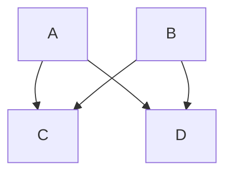

# Markdown Syntax

## Introductory Readings
- [Introduction to Basic Markdown Syntax](https://www.markdownguide.org/basic-syntax/)
	- There are many markdown variations. Obsidian's syntax is based on commonmark. Here are two good places to start:
		- [Markdown Reference](https://commonmark.org/help/)
		- [Markdown Tutorial - Introduction](https://commonmark.org/help/tutorial/index.html)
- [John Gruber's Original Documentation](https://daringfireball.net/projects/markdown/)
- The full syntax used by Obsidian (including its [[#Obsidian's Custom markdown syntax|custom syntax]]) is described here: [Format your notes - Obsidian Help](https://help.obsidian.md/How+to/Format+your+notes)

### Obsidian's Custom markdown syntax

- Links use the `[[wikilink]]` format, but you can switch to markdown links in the settings if you want. 
	- `[[wikilink#]]` to link to headers
	- `[[wikilink#^]]` to link to individual "blocks"
- You can use a `|` to modify the text being displayed, e.g. `[[wikilink|display text]]`.
- Adding `!` before a link, e.g. `![[wikilink]]` will embed the file, but you can also embed headers (anything starting with `#`) or blocks (using `^`).
	- `![[wikilink]]` for the full note
	- `![[wikilink#Header]]` for headers
	- `![[wikilink#^blockid]]` for individual "blocks"
- It recognizes tags, e.g. #tutorial and clicking on them will open a search
- You can add highlights by surrounding text with `==`, e.g. `==highlight==`, and strikethrough with `~~`, e.g.`~~strikethrough~~`
- It supports [MathJax](https://www.mathjax.org/) to write formulas/equations: `$x^2 + y^2 = z^2$` looks like $x^2 + y^2 = z^2$
- Text enclosed in `%%` are considered comments and won't be rendered `%% Comments %%`

#### Callouts

Callouts were recently added to highlight information, e.g. 

```markdown
> [!info] Callout title
> Content of callout
```

results in: 

> [!info] Callout title
> Content of the callout

#### Mermaid diagrams

Supports rendering [mermaid](https://mermaid-js.github.io/mermaid/#/) diagrams, e.g. 

````markdown

````

results in:


## Lesser known Markdown Syntax
- Indenting text with a preceding blank lines is rendered as ==code block== (which is why it changes color, which gets asked quite often).
- A dash (`-`) or equal sign (`=`) below some text turns it into a heading, due to the older (but still supported) *setext-syntax* for Markdown headings. Continuing to write some non-dash-non-equal-sign-character fixes this already.
- When using the `Strict Line Breaks` setting, a single line break can be created by placing two spaces at the end of a line (["Two Space Rule"](https://daringfireball.net/projects/markdown/syntax#p)) 
	- Since `Strict Line Breaks` makes Obsidian ignore single line breaks, they can be used for  [Semantic Line Breaks](https://sembr.org/)
- To write special characters like `*` or `$` without them triggering some markup like *italics* or Mathjax, they need to be escaped by putting a backlash in front of it: `\*` or `\$`.
- Lists that have single blank lines in between the list items are considered =="loose lists"== and which get extra spacing between each list item. To remove that spacing, simply remove the blank lines between list items. (Note that some themes already disable loose lists by default.)
- To get a line break in a Markdown table, use `<br>`.
- To get a code block in a code block, you can use four backticks. (To have a code block in a code block in a code block, you would use five, etc.)
	
`````md
````md
	```md
	fsfsfsf
	```
````
`````

%% Hub footer: Please don't edit anything below this line %%

# This note in GitHub

<span class="git-footer">[Edit In GitHub](https://github.dev/obsidian-community/obsidian-hub/blob/main/04%20-%20Guides%2C%20Workflows%2C%20%26%20Courses/Guides/Markdown%20Syntax.md "git-hub-edit-note") | [Copy this note](https://raw.githubusercontent.com/obsidian-community/obsidian-hub/main/04%20-%20Guides%2C%20Workflows%2C%20%26%20Courses/Guides/Markdown%20Syntax.md "git-hub-copy-note") | [Download this vault](https://github.com/obsidian-community/obsidian-hub/archive/refs/heads/main.zip "git-hub-download-vault") </span>
