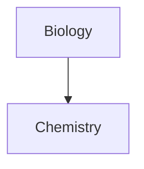
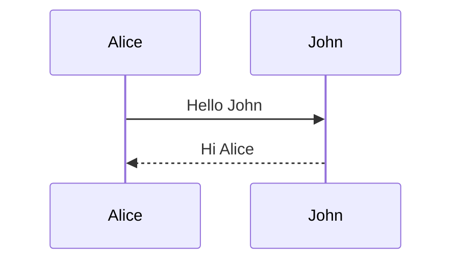

# Obsidian Markdown Cheat Sheet

Every core Obsidian Markdown syntax on one note, each section verified against the official Obsidian Help. Renders entirely with built-in Obsidian features, no plugins required.

## Markdown Basics

Obsidian fully supports standard Markdown — headings, bold, and italic work exactly as they do in CommonMark.

### Headings

```markdown
# Heading 1
## Heading 2
### Heading 3
```

Up to six levels; the number of # symbols sets the level shown in the outline.

### Bold

```markdown
**bold text**
```

Double asterisks; double underscores (__text__) also work.

### Italic

```markdown
*italic text*
```

Single asterisks; single underscores (_text_) also work.

> Source: [Obsidian Help](https://help.obsidian.md/syntax) · Last verified 2026-07-18

## Wikilinks (Internal Links)

Wikilinks connect notes by name inside double brackets — no file path required. Obsidian can update them automatically when you rename a note.

### Basic Link

```markdown
[[Page Name]]
```

Link to another note

### Link with Alias

```markdown
[[Page Name|Display Text]]
```

Link with custom display text

### Link to Heading

```markdown
[[Page Name#Heading]]
```

Link to a specific heading; add more # symbols for subheadings

### Link to Block

```markdown
[[Page Name#^block-id]]
```

Link to a specific block; type ^ after # to pick from suggestions

- Link text may not contain the characters # | ^ : %% [[ ]].
- Block references are Obsidian-specific and will not resolve outside Obsidian.

> Source: [Obsidian Help](https://help.obsidian.md/links) · Last verified 2026-07-18

## Wikilinks vs Markdown Links

Both formats link between notes and render identically. Wikilinks are the default; disable "Use [[Wikilinks]]" under Settings → Files and Links for maximum interoperability.

### Wikilink Format

```markdown
[[Three laws of motion]]
```

Compact and vault-native; autocompletes when you type [[

### Markdown Format

```markdown
[Three laws of motion](Three%20laws%20of%20motion.md)
```

Portable to other Markdown tools; URL-encode spaces as %20

- Even with wikilinks disabled, typing [[ still autocompletes — Obsidian then inserts a Markdown link.

> Source: [Obsidian Help](https://help.obsidian.md/links) · Last verified 2026-07-18

## Embeds

Prefix any internal link with ! to embed the content inline instead of linking to it.

### Embed Note

```markdown
![[Note Name]]
```

Embed an entire note

### Embed Heading

```markdown
![[Note#Heading]]
```

Embed a specific section of another note

### Embed Image

```markdown
![[image.png|100]]
```

Embed a vault image; |100 sets the width, |640x480 sets width and height

### Embed PDF

```markdown
![[document.pdf#page=3]]
```

Embed a PDF; #page=N opens a specific page, #height=400 sets the viewer height

> Source: [Obsidian Help](https://help.obsidian.md/embeds) · Last verified 2026-07-18

## Callouts

Add [!type] to the first line of a blockquote. Thirteen built-in types with aliases; an unknown type falls back to note.

### Note

```markdown
> [!note]
> Content here
```

Information callout — the fallback for unknown types

### Tip

```markdown
> [!tip]
> Content here
```

Aliases: hint, important

### Warning

```markdown
> [!warning]
> Content here
```

Aliases: caution, attention

### Question

```markdown
> [!question]
> Content here
```

Aliases: help, faq

### Collapsible

```markdown
> [!note]- Title
> Hidden content
```

A minus collapses the callout by default; a plus expands it

- Type identifiers are case-insensitive.
- Callouts nest and support Markdown, wikilinks, and embeds inside.

> Source: [Obsidian Help](https://help.obsidian.md/callouts) · Last verified 2026-07-18

## Properties (YAML Frontmatter)

YAML between --- lines at the very top of a note. Property types: text, list, number, checkbox, date, date & time. Default properties: tags, aliases, cssclasses.

### YAML Frontmatter

```markdown
---
title: My Note
tags:
  - project
  - draft
---
```

Note metadata; tags in YAML must be formatted as a list

### Aliases

```markdown
aliases:
  - Project kickoff
```

Alternative note names for linking and search, one per line

- Markdown is not rendered inside property values — an intentional limitation.
- Wikilinks in text or list properties must be wrapped in quotes.
- Nested properties are not supported in the properties UI; view them in Source mode.

> Source: [Obsidian Help](https://help.obsidian.md/properties) · Last verified 2026-07-18

## Tags

Tags are clickable keywords. Add them inline with a # prefix or via the tags property.

### Tag

```markdown
#project
```

Click a tag to search for it across the vault

### Nested Tag

```markdown
#inbox/to-read
```

Slashes create a hierarchy; searching tag:inbox also matches nested tags

- No blank spaces — use camelCase, PascalCase, snake_case, or kebab-case for multiple words.
- A tag must contain at least one non-numeric character: #1984 is not valid, #y1984 is.
- Tags are case-insensitive: #tag and #TAG are treated as the same tag.

> Source: [Obsidian Help](https://help.obsidian.md/tags) · Last verified 2026-07-18

## Highlight

### Highlight

```markdown
==highlighted text==
```

Marker-style highlight; an Obsidian extension, not standard Markdown

> Source: [Obsidian Help](https://help.obsidian.md/syntax) · Last verified 2026-07-18

## Strikethrough

### Strikethrough

```markdown
~~strikethrough~~
```

A GitHub Flavored Markdown extension, fully supported in Obsidian

> Source: [Obsidian Help](https://help.obsidian.md/syntax) · Last verified 2026-07-18

## Comments

Text wrapped in %% is only visible in Editing view — it disappears in Reading view and on published sites.

### Inline Comment

```markdown
This stays visible %%this is hidden%% in the note.
```

Hide part of a line

### Block Comment

```markdown
%%
Draft notes here.
Block comments span multiple lines.
%%
```

Hide whole paragraphs

- Obsidian-only syntax — the %% markers render as literal text in other Markdown apps.

> Source: [Obsidian Help](https://help.obsidian.md/syntax#Comments) · Last verified 2026-07-18

## Footnotes

### Footnote

```markdown
A sentence with a note.[^1]

[^1]: The referenced text.
```

Named footnotes like [^note] also work; they still render as numbers

### Inline Footnote

```markdown
An inline footnote.^[The note text goes here.]
```

Caret goes outside the brackets; works in Reading view only, not in Live Preview

> Source: [Obsidian Help](https://help.obsidian.md/syntax#Footnotes) · Last verified 2026-07-18

## Tables

### Basic Table

```markdown
| First name | Last name |
| --- | --- |
| Max | Planck |
```

Cells need no alignment, but the header separator must contain at least two hyphens

### Column Alignment

```markdown
| Left | Center | Right |
| :-- | :--: | --: |
| a | b | c |
```

Colons in the separator row set left, center, or right alignment

- Escape a pipe inside a cell as \| — required for wikilink aliases and image sizes in tables.
- In Live Preview, right-click a table to add, move, or sort rows and columns.

> Source: [Obsidian Help](https://help.obsidian.md/advanced-syntax#Tables) · Last verified 2026-07-18

## Math (LaTeX)

Math expressions render with MathJax using LaTeX notation.

### Inline Math

```markdown
$e^{2i\pi} = 1$
```

Single dollar signs render math within a sentence

### Block Math

```markdown
$$
\sum_{i=1}^n x_i = \frac{n(n+1)}{2}
$$
```

Double dollar signs on their own lines render a display block

> Source: [Obsidian Help](https://help.obsidian.md/advanced-syntax#Math) · Last verified 2026-07-18

## Mermaid Diagrams

A mermaid code block renders as a diagram — flowcharts, sequence diagrams, timelines, and more.

### Flowchart

````markdown

````

Rendered as a diagram in Reading view and Live Preview

### Sequence Diagram

````markdown

````

One of many Mermaid diagram types Obsidian supports natively

- Attach the internal-link class to a node to turn it into a note link.

> Source: [Obsidian Help](https://help.obsidian.md/advanced-syntax#Diagram) · Last verified 2026-07-18

## Unsupported & Edge Behavior

Obsidian supports CommonMark, GitHub Flavored Markdown, and LaTeX math — with a few deliberate exceptions worth knowing before you port notes.

### Markdown Inside HTML

```markdown
<div>
This **will not** be bold.
</div>
```

Obsidian intentionally does not render Markdown syntax inside HTML elements

### Block References Elsewhere

```markdown
[[Note#^block-id]]
```

Block reference links only resolve inside Obsidian; they break in other Markdown tools

### Underline

```markdown
<u>underlined text</u>
```

No Markdown syntax exists for underline; raw HTML works, but Markdown inside HTML is not processed

- Single line breaks are treated as a continuation of the paragraph in Reading view, matching standard Markdown soft-wrap behavior.

> Source: [Obsidian Help](https://help.obsidian.md/obsidian-flavored-markdown) · Last verified 2026-07-18

## Markdown vs Obsidian: Compatibility

| Feature | Syntax | CommonMark/GFM | Obsidian | Notes |
| --- | --- | --- | --- | --- |
| Headings, bold, italic | `# H1, **bold**, *italic*` | yes | yes | Core CommonMark syntax, identical in Obsidian. |
| Strikethrough | `~~text~~` | partial | yes | GFM extension, not part of CommonMark. |
| Highlight | `==text==` | no | yes | Obsidian extension; shows as literal == elsewhere. |
| Tables | `\| A \| B \|` | partial | yes | GFM extension; Obsidian adds Live Preview table editing. |
| Task lists | `- [x] done` | partial | yes | GFM extension; any character inside the brackets marks a task complete in Obsidian. |
| Footnotes | `[^1]` | partial | yes | GFM extension; inline ^[...] footnotes are Obsidian-only. |
| Tags | `#tag` | no | yes | Renders as a plain heading-less #word elsewhere; searchable metadata in Obsidian. |
| Wikilinks | `[[Note]]` | no | yes | Obsidian-only; renders as literal brackets in CommonMark/GFM. |
| Embeds | `![[Note]]` | no | yes | Obsidian-only transclusion syntax. |
| Callouts | `> [!note]` | partial | yes | GitHub alerts support five fixed types; Obsidian adds 13 types, aliases, folding, and nesting. |
| Comments | `%%hidden%%` | no | yes | Visible as literal text outside Obsidian; hidden in Obsidian Reading view. |
| Math | `$x^2$` | no | yes | Not in CommonMark or GFM core; Obsidian renders via MathJax. |
| Mermaid diagrams | `` ```mermaid `` | partial | yes | GitHub.com also renders mermaid blocks; plain CommonMark/GFM treat them as code. |
| Properties (frontmatter) | `---<br>key: value<br>---` | no | yes | Not parsed by CommonMark/GFM; Obsidian turns the YAML block into typed note properties. |
| Markdown inside HTML | `<div>**text**</div>` | partial | no | Obsidian deliberately skips Markdown inside HTML elements; CommonMark processes inline Markdown around HTML. |


## Source

This cheat sheet is maintained at [markdowntools.io](https://www.markdowntools.io/obsidian-cheat-sheet), where it is also available as a [vault-ready download](https://www.markdowntools.io/downloads/obsidian-markdown-cheat-sheet.md) and a [printable PDF](https://www.markdowntools.io/pdf/obsidian-markdown-cheat-sheet.pdf). Related Hub note: [[Markdown Syntax]].

%% Hub footer: Please don't edit anything below this line %%

# This note in GitHub

<span class="git-footer">[Edit In GitHub](https://github.dev/obsidian-community/obsidian-hub/blob/main/04%20-%20Guides%2C%20Workflows%2C%20%26%20Courses/Guides/Obsidian%20Markdown%20Cheat%20Sheet.md "git-hub-edit-note") | [Copy this note](https://raw.githubusercontent.com/obsidian-community/obsidian-hub/main/04%20-%20Guides%2C%20Workflows%2C%20%26%20Courses/Guides/Obsidian%20Markdown%20Cheat%20Sheet.md "git-hub-copy-note") | [Download this vault](https://github.com/obsidian-community/obsidian-hub/archive/refs/heads/main.zip "git-hub-download-vault") </span>
